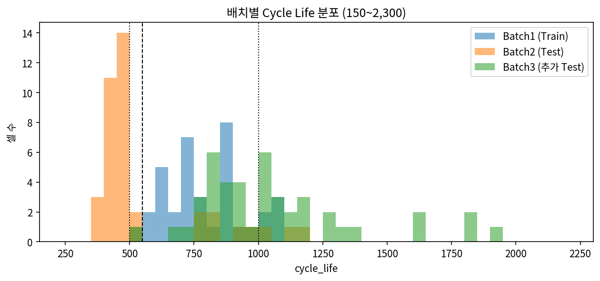
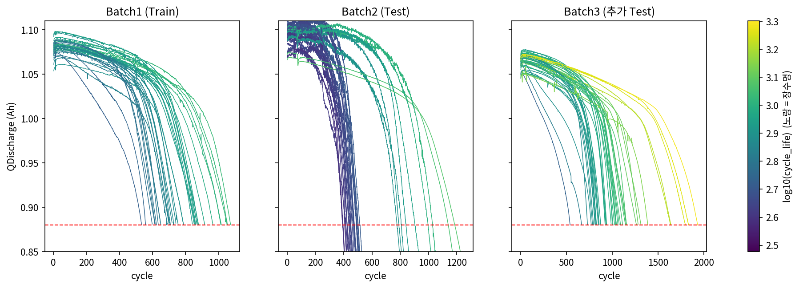
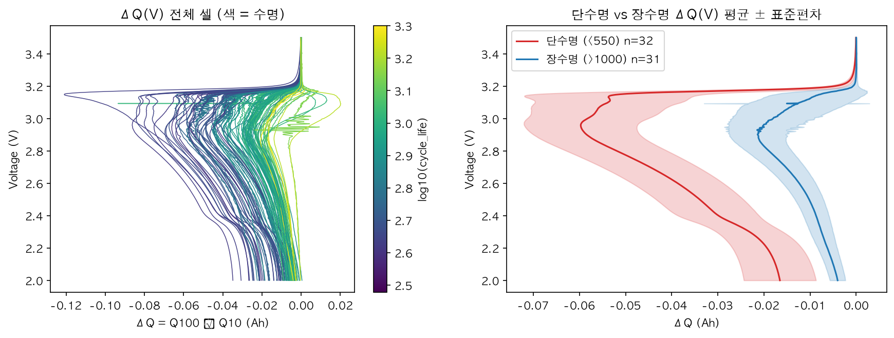
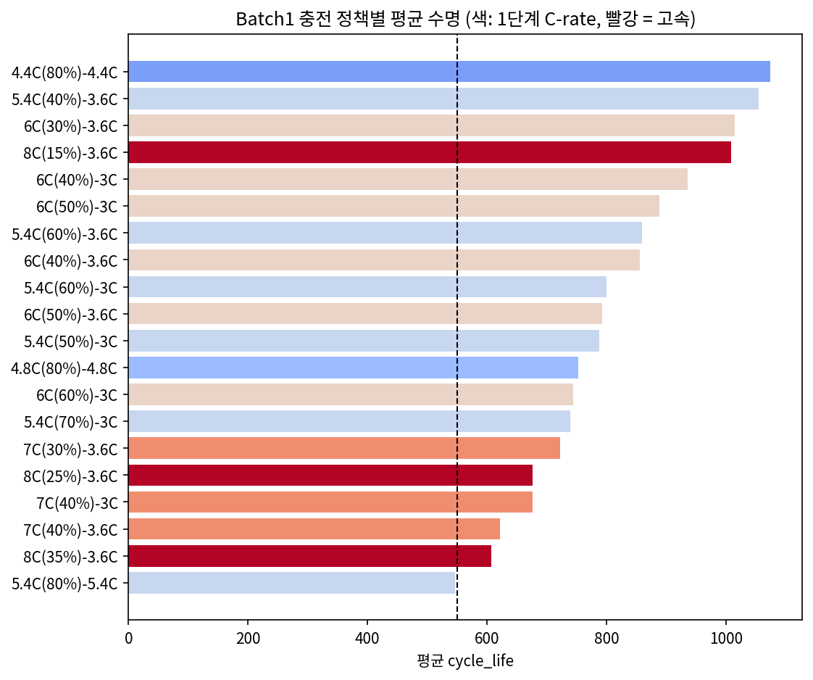
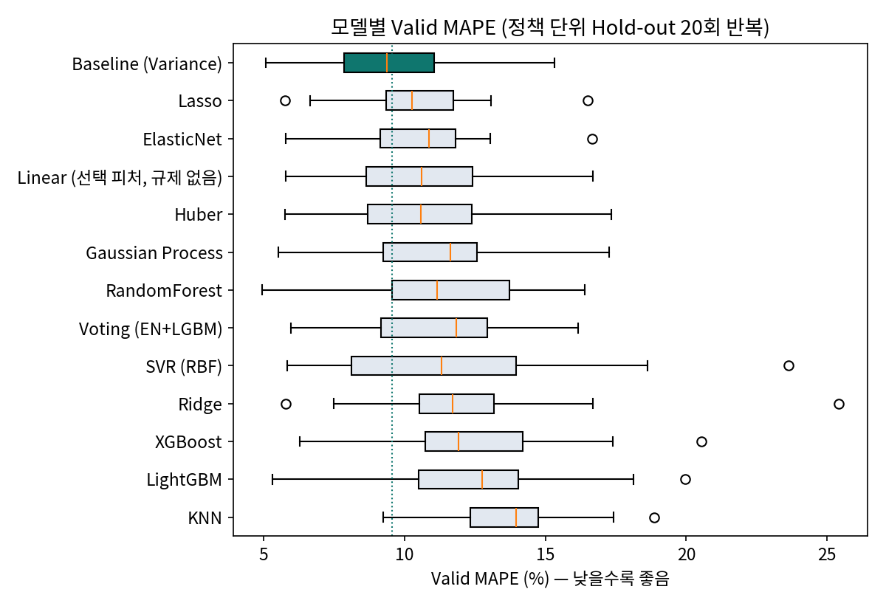
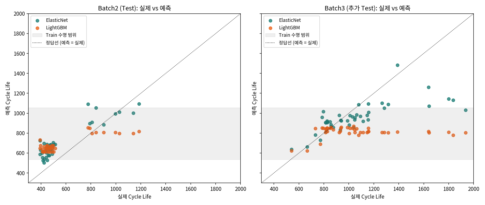
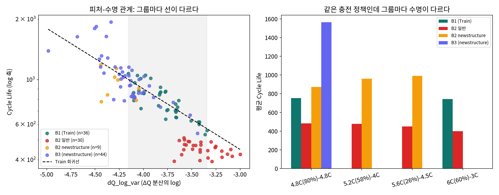

# ESS 배터리 수명 예측

배터리 셀의 **초기 100사이클 데이터만으로 수명(Cycle Life)을 예측**한다.
수명을 미리 알면 ESS 운영에서 교체 시점을 계획하고, 출하 단계에서 단수명 셀을 선별할 수 있다.
이 프로젝트는 성능 자체보다 **"전략 → 구현 → 검증 → 전략 수정"** 과정을 기록하는 데 초점을 뒀다 (전체 과정: [`docs/learning-log.md`](docs/learning-log.md)).


## 프로젝트 개요
- 데이터셋 : MIT-Stanford Battery Dataset (Severson et al., Nature Energy 2019)
- 학습 데이터 : Batch 1 (2017-05-12)
- 평가 데이터 : Batch 2 (2018-02-20), 추가 검증 Batch 3 (2018-04-12)
- 태스크 : **Regression (Cycle Life 예측)**, 타깃 `log10(cycle_life)`
  - Cycle Life = 방전용량이 정격 1.1Ah의 80%(0.88Ah)에 처음 도달한 사이클 수 (SOH 80%, ESS 교체 기준)
  - 분류를 택하지 않은 이유: Batch1에서 550 미만(단수명) 셀이 36개 중 1개뿐이라 단수명 클래스를 학습할 수 없음


## 주요 시각자료
| 무엇을 보여주나 | 그림 |
|---|---|
| 배치마다 수명 분포가 다르다 (Test가 Train 범위 밖) | [q1_cycle_life_hist.png](results/figures/q1_cycle_life_hist.png) |
| 열화는 가속되고, 100사이클까지는 셀 구별이 안 된다 | [q2_qd_curves_all.png](results/figures/q2_qd_curves_all.png), [q2_knee_vs_life.png](results/figures/q2_knee_vs_life.png) |
| ΔQ(V)에서 단수명·장수명이 갈린다 (핵심 피처 근거) | [q3_delta_q_curves.png](results/figures/q3_delta_q_curves.png) |
| 충전 정책별 평균 수명 | [q4_life_by_policy.png](results/figures/q4_life_by_policy.png) |
| 피처 상관과 다중공선성 | [q5_corr_with_life.png](results/figures/q5_corr_with_life.png), [q5_feature_corr.png](results/figures/q5_feature_corr.png) |
| 모델 13개 Valid 비교 → Baseline 선택 | [model_selection_boxplot.png](results/figures/model_selection_boxplot.png) |
| 트리 모델은 Train 범위 밖을 예측 못 한다 | [diag_extrapolation.png](results/figures/diag_extrapolation.png) |
| Batch2 오차의 원인 (같은 피처에서 수명이 다름) | [batch_shift.png](results/figures/batch_shift.png) |


## 파일 구조
```
├── data/
│   ├── README.md              # 데이터 출처·다운로드 방법 (원본 .mat은 용량 문제로 미포함)
│   ├── raw/                   # Kaggle .mat 원본 위치
│   └── processed/             # 전처리 결과 (pkl/csv, git 제외)
├── notebooks/
│   ├── 01_EDA.ipynb           # EDA 질문 5개 (Part 2)
│   ├── 02_feature_engineering.ipynb
│   └── 03_modeling.ipynb      # 학습·모델 선택·진단·오류 분석 결과 정리
├── src/
│   ├── preprocess.py          # .mat 로딩, 셀 정리, 노이즈 처리
│   ├── features.py            # 셀 1개 = 1행 피처 (ΔQ(V) 등, 사이클 100 이하만 사용)
│   └── train.py               # 학습·평가·성능 리포트 (최종 파이프라인)
├── experiments/               # 전략 검증 실험 (결과는 results/)
│   ├── split_leakage_check.py # 분할 방식별 누수 확인
│   ├── model_diagnostics.py   # 피처 의존도, 외삽 확인
│   ├── batch_shift_analysis.py# Batch2 오차 원인 분석
│   ├── model_selection.py     # 최종 모델 선택 (반복 Hold-out)
│   ├── model_zoo.py           # DAY1 후보 밖 모델 10개 비교
│   └── tuning_deep.py         # 넓은 하이퍼파라미터 탐색
├── results/
│   ├── model_performance.csv  # 최종 모델 성능 (과제 포맷)
│   ├── model_performance_all.csv
│   ├── predictions.csv
│   └── figures/
├── docs/
│   ├── DS-MINI-Design-울산_2반-변현준.pdf   # DAY1 모델 전략
│   ├── learning-log.md        # 결정·근거·시행착오 기록
│   └── day2-requirements.md
├── requirements.txt
└── README.md
```


## 환경 설정
```bash
git clone https://github.com/insidesight0921-stack/ess-battery-life-prediction
cd ess-battery-life-prediction
python3 -m venv .venv && source .venv/bin/activate
pip install -r requirements.txt

# data/raw/에 Kaggle .mat 3개를 넣은 뒤 (data/README.md 참고)
python -m src.preprocess     # 셀 정리 → data/processed/
python -m src.features       # 피처 생성
python -m src.train          # 학습·평가 → results/model_performance.csv
```

검증 실험 재현 (결과는 `results/`, 실행 시간은 맥 기준 대략치)
```bash
python -m experiments.split_leakage_check   # 분할 방식별 누수 확인 (~1분)
python -m experiments.model_diagnostics     # 피처 의존도·외삽 확인 (~30초)
python -m experiments.batch_shift_analysis  # Batch2 오차 원인 (~10초)
python -m experiments.model_selection       # 최종 모델 선택, 20회 반복 (~2분)
python -m experiments.model_zoo             # 후보 밖 모델 10개 비교 (~5분)
python -m experiments.tuning_deep           # 넓은 하이퍼파라미터 탐색 (~5분)
```


## EDA
(상세: `notebooks/01_EDA.ipynb`, `docs/DS-MINI-Design-울산_2반-변현준.pdf`)

**데이터 정리** : 정답이 불확실한 셀 제거 → Batch1 46→36, Batch2 47→39, Batch3 46→44셀
- Batch1 10셀은 EOL(0.88Ah) 도달 전에 기록 종료(최소 용량 0.91~1.04Ah) → 기록된 수명이 실제보다 짧음
- Batch2·3의 수명값 없는 셀(VarCharge·SLOWCYCLE 특수 실험 등) 제거

- Cycle Life 분포
  - 중앙값 Batch1 773 / Batch2 472 / Batch3 1,006. 단수명(<500) Batch1 0%, Batch2 72% / 장수명(>1,000) Batch3 52%
  - Batch1 최단수명 2셀(534·559)은 5.4C(80%) 급속충전, 초기 충전시간 9.0분(Batch1 최단)
  - 핵심 발견 : **Test 셀 대부분이 Train 수명 범위 밖** → 범위 밖도 예측하는(외삽) 선형 모델과 log 타깃이 필요

  

- 열화 곡선 분석
  - 장수명·단수명 모두 초반에는 거의 평평하다가 급격히 꺾임 (수명 마지막 10% 구간 감소 속도가 10~20% 구간의 약 25배)
  - Knee point는 수명의 약 75% 지점 (Batch1)
  - 핵심 발견 : **100사이클 시점의 용량 숫자로는 셀 구별이 안 됨** (1.06~1.10Ah에 모두 겹침)

  

- ΔQ(V) 곡선 분석
  - ΔQ(V) = Q₁₀₀(V) − Q₁₀(V), 단수명 셀은 3.0V 부근에서 크게 음수 (평균 −0.058 vs 장수명 −0.018Ah)
  - ΔQ 분산(log) 중앙값 단수명 −3.42 vs 장수명 −4.25
  - 핵심 발견 : **용량 숫자에 안 보이던 열화가 곡선 모양에서 보임**, `dQ_log_var`와 log 수명 상관 r = −0.84 (Batch1)

  

- 충전 속도(C-rate)와 수명의 관계
  - Batch1 정책 20개 평균 수명 547(5.4C(80%)) ~ 1,074(4.4C(80%))
  - 핵심 발견 : **C-rate 자체(ρ = −0.24)보다 충전시간(ρ = +0.43)이 수명과 더 관련**, 충전시간이 짧을수록 열화 속도가 빠름(ρ = −0.53)

  

- 추가 확인 : 상관관계·다중공선성
  - dQ 피처끼리 상관 최대 0.98 (dQ_log_var ↔ dQ_log_mean) → 규제 또는 피처 축소 필요


## Modeling

### 피처 엔지니어링 전략
(상세: `notebooks/02_feature_engineering.ipynb`, `src/features.py`)
- 원칙 : 사이클 100 이하 데이터만 사용(조기 예측, 미래 정보 누수 방지), 피처 선택은 **Train 부분만** 보고 결정
- 셀 1개 = 1행으로 요약 : ΔQ(V) 통계량(분산·최소·평균·왜도·첨도·2V 값), 초기 용량·변화량·기울기, 내부저항, 온도, 충전시간 (후보 16개)
- 선택 규칙(`select_features`) : 타깃과 |r| ≥ 0.4인 피처를 |r| 순으로 고르되, 이미 고른 피처와 |r| > 0.85면 제외
  - 실제 파이프라인(정책 Hold-out 후 Train 29셀) 결과 : `dQ_log_var`, `QD_c100_minus_c2`, `dQ_skew`, `chargetime_mean_5`
  - VIF : 후보 전체 최대 수만 → 선택 후 3.2 이하
- 선택 안정성 : 분할을 20번 바꿔 다시 고르면 **`dQ_log_var`만 20/20**, 나머지는 13~17/20으로 들쭉날쭉 → 확실한 신호는 하나뿐
- 시행착오 : DAY1에는 규칙을 적어 두고 손으로 6개를 골랐는데, 코드로 적용해 보니 규칙과 달랐음(`dQ_at_2V`는 `dQ_log_var`와 0.88로 위반). 규칙을 코드로 고정하고 전체 재실행 (결론은 동일)

### 데이터 분할
- Batch1 → Train 80% / Valid 20%를 **충전 정책 단위**로 분할 (같은 정책 셀이 양쪽에 들어가지 않음)
  - 처음엔 셀 단위 무작위 분할 → Valid 8셀 중 5셀이 같은 정책의 짝 셀을 Train에 두고 있었음
  - seed 30회 비교: 무작위 분할이 Valid MAPE를 0.4~0.7%p 낙관적으로 보이게 함 (`experiments/split_leakage_check.py`)
- Train CV·튜닝도 정책 단위 GroupKFold
- Batch2·3은 학습·튜닝·피처 선택·모델 선택에 사용하지 않음

### 모델 선택 및 근거
- 후보 모델 (DAY1 전략) : 선형회귀(Baseline, `dQ_log_var` 1개), ElasticNet, LightGBM, Voting(ElasticNet+LightGBM)
- 추가 비교 : Linear(규제 없음), Ridge, Lasso, Huber, SVR, KNN, Gaussian Process, RandomForest, XGBoost + 넓은 하이퍼파라미터 탐색
- 최종 모델 : **Baseline — `dQ_log_var` 1개 선형회귀** (원 논문의 "Variance 모델"과 같은 구조)
- 선택 이유 (정책 단위 Hold-out 20회 반복, 매번 Train에서 피처 선택·튜닝, Valid만 사용)

| 모델 | Valid MAPE 평균 | 표준편차 | Baseline보다 나은 횟수 |
|---|---|---|---|
| **Baseline** | **9.55%** | 2.56 | — |
| Lasso | 10.39% | 2.41 | 8/20 |
| ElasticNet | 10.51% | 2.47 | 8/20 |
| Linear (규제 없음) | 10.59% | 2.86 | 9/20 |
| Huber | 10.67% | 2.92 | 11/20 |
| RandomForest | 11.27% | 3.00 | 6/20 |
| Voting (EN+LGBM) | 11.28% | 2.77 | 2/20 |
| LightGBM | 12.73% | 3.45 | 1/20 |



- 해석
  - Baseline이 평균·안정성 모두 가장 좋지만, 선형 계열과의 차이는 1%p 안팎으로 작음 → "Baseline보다 낫다는 일관된 증거가 있는 모델이 없다"가 정확한 표현
  - Huber는 20번 중 11번 이겼지만 가끔 크게 틀려 평균이 1.1%p 나쁨
- DAY1 전략(Voting)에서 바꾼 이유
  - Train 29셀 + 강한 단일 신호(r = −0.84) → 피처·모델을 복잡하게 할수록 정보보다 흔들림(분산)이 커짐
  - ElasticNet도 L1 규제로 결국 `dQ_log_var` 위주가 됨 (나머지 계수 대부분 0)
  - 트리 계열(LightGBM·RF·XGBoost)과 KNN은 **Train 범위 밖 예측 불가** → Batch3 예측 최대가 862~906에 막힘 (아래 그림 주황 점이 수평으로 누움)

    
  - 넓게 튜닝해도 못 이김. 튜닝 중 CV 점수가 실제보다 좋아 보이는 착시도 생김 (SVR: CV 10.1% → Valid 13.5%)
- 참고 Test에서는 Huber·규제 없는 선형이 Batch3 11.3%로 Baseline(12.2%)보다 좋았지만, Test로 모델을 고르면 누수이므로 선택에 반영하지 않음


## 성능 결과
최종 모델 : Baseline (`dQ_log_var` 선형회귀) / `results/model_performance.csv`

MAPE는 낮을수록 좋으므로 Gap은 "(+) = 문제 의심"이 되도록 **나중 단계 오차 − 앞 단계 오차**로 계산

| 구분 | | MAPE (%) | 비고 |
|---|---|---|---|
| Train (Batch 1 CV) | | 9.17 | 정책 단위 5-fold |
| Valid (Batch 1 Hold-out) | | 8.09 | 정책 단위 20% (7셀) |
| Test (Batch 2) | | **29.62** | |
| | Gap (Train-Valid) | −1.08 | Valid−Train. 과적합 징후 없음 (Valid 7셀이라 ±2%p 흔들림) |
| | Gap (Valid-Test) | +21.53 | Test−Valid. 배치 간 일반화 실패 |
| | Gap (Target-Test) | +20.52 | Test−9.1%. 원 논문 목표 미달 |
| Test (Batch 3) | | **12.16** | |
| | Gap (Batch2-Batch3) | +17.46 | Batch2가 훨씬 나쁨 |
| | Gap (Target-Test) | +3.06 | Batch3−9.1%. 목표에 근접 |

- Batch1 안(Train·Valid)에서는 원 논문 수준(8~9%), Batch3에서도 근접(12%)
- Batch2만 30% → 원인은 아래 오류 분석


## 오류 분석
(상세: `experiments/batch_shift_analysis.py`, `experiments/model_diagnostics.py`, `results/figures/batch_shift.png`)

- 모델이 가장 크게 틀린 셀의 공통점
  - **Batch2** : 39셀 중 95%를 길게 예측. 오차 상위는 `newstructure` 표시가 없는 일반 셀
    (예: b2_c06 실제 393 → 예측 723, 3.6C(9%)-5C). 일반 30셀 MAPE 33.9% vs newstructure 9셀 15.4%
  - **Batch3** : 오차 상위는 수명 1,600 이상 장수명 셀을 짧게 예측 (b3_c38 실제 1,935 → 1,101). Train 수명 최대(1,054, 정책 Hold-out 후 29셀 기준) 초과 17셀 MAPE 15.9% vs 범위 안 27셀 9.8%


- 원인 가설
  1. **Batch2 일반 셀은 "ΔQ → 수명" 관계 자체가 다름** (가장 큰 원인)
     - 같은 `dQ_log_var` 값에서 Batch1보다 수명이 약 30% 짧음 (Train 회귀선 대비 평균 잔차 +31.8%, 30셀 모두 같은 방향)
     - 같은 충전 정책도 배치마다 수명이 다름 : 4.8C(80%)-4.8C → Batch1 753 / Batch2 일반 484 / Batch3 1,564
     - Batch3는 Train 회귀선을 거의 그대로 따름(평균 잔차 +1.0%) → 관계는 일반화되지만 Batch2 일반 셀에서만 깨짐
     - Batch2 일반 셀이 왜 다른지는 데이터만으로는 확인 불가 (미확인). 과제 안내에도 배치 간 수개월 공백과 일부 셀 품질 문제 언급
  2. **외삽 한계** : Batch3 장수명 셀은 Train 범위 밖이라 선형 모델도 끝까지 따라가지 못함
- 개선 방향
  - 새 배치·조건마다 소량의 수명 데이터로 절편 재보정 (Test 정답으로 하면 누수라 이번엔 하지 않음)
  - 배치·실험 조건을 설명하는 메타데이터(제조 시기, 휴지 시간, 셀 구조 등) 확보 후 피처화
  - Train 배치를 늘려 수명 범위를 넓힘 (외삽 부담 감소)


## ESS 도메인 해석
- 실제 BESS에 적용한다면 어떤 의사결정에 활용 가능한가?
  - **셀 선별(입고 검사)** : 100사이클 시험 데이터로 단수명 셀을 미리 걸러 랙 구성 시 수명 편차를 줄임
  - **교체 계획** : 예상 수명으로 교체 예산·시점을 미리 잡음. 셀·모듈은 BESS 초기 설비비(CAPEX)의 약 25~45%를 차지해 (S&P Global 2026 추정, [pv magazine](https://www.pv-magazine.com/2026/04/29/the-battery-cost-disconnect/)), 교체 시점이 틀리면 비용 영향이 큼
  - **운영 정책** : 충전시간이 짧을수록 열화가 빠르다는 결과 → 급속충전 비중을 조절하는 근거
  - 단, 같은 생산 배치·같은 운영 조건 안에서만 오차 약 10% 수준을 기대할 수 있음
- 어떤 한계가 있으며, 실 배포를 위해 추가로 필요한 것은 무엇인가?
  - **조건이 바뀌면 크게 틀림** : Batch2처럼 배치나 조건이 다르면 오차 30%. 그대로 배포하면 수명을 길게 잡아 교체가 늦어지는 위험 쪽으로 틀림
  - **필요한 것**
    - 새 배치마다 소량의 셀로 검증·재보정하는 절차
    - 예측 불확실성(구간) 제공 : 점 예측만으로는 교체 의사결정에 위험
    - 실제 ESS 운영 데이터(부분 충방전, 온도 변화, 휴지기) 검증 : 실험실은 0~100% 완전 충방전·항온 조건
  - 셀 단위 예측 → 실제 운영은 모듈·랙 단위라 셀 간 편차·온도 분포를 반영하는 확장 필요


## 참고문헌
- Severson et al. (2019). Data-driven prediction of battery cycle life before capacity degradation. *Nature Energy*, 4, 383–391.
- 배터리 비용 비중 : pv magazine (2026-04-29), "The battery cost disconnect" (S&P Global 인용), NREL ATB 2024 Utility-Scale Battery Storage
- 데이터 : [Kaggle - Data-driven prediction of battery cycle](https://www.kaggle.com/datasets/itshpark/data-driven-prediction-of-battery-cycle)


## 팀 구성
- 변현준 (울산_2반) : EDA, 피처 엔지니어링, 모델 개발, 성능 평가(Batch2·Batch3), 오류 분석
